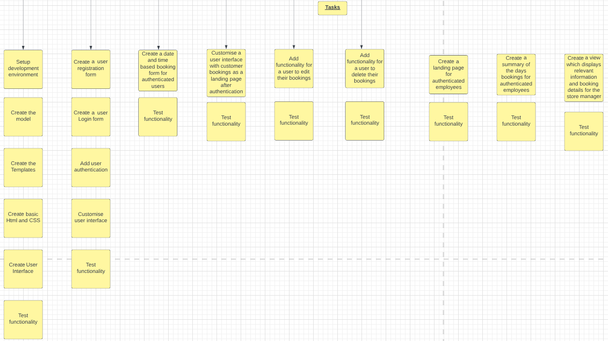
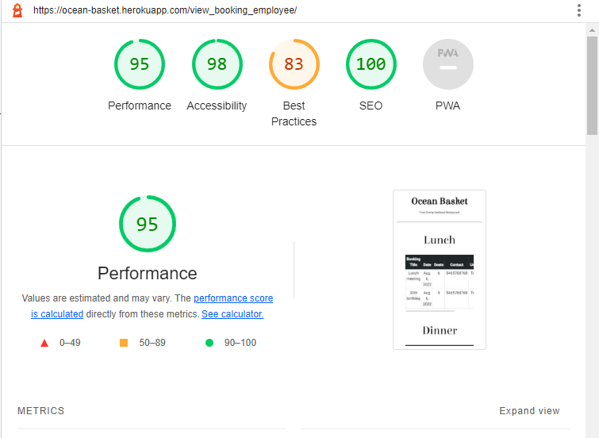
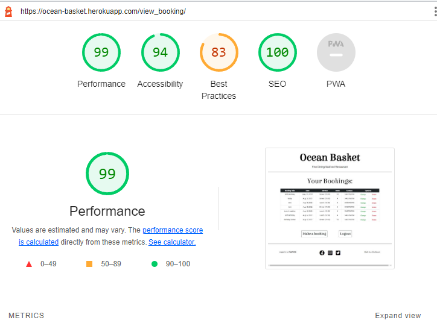

# Ocean Basket Restaurant Online Bookings

## Introduction

Ocean Basket Restaurant is the name of my project, it is a project showcasing the use of a fullstack toolkit that I used for creating a minimal viable product in its first iteration according to the projects users goal. The idea was to create a basic website with only the functionality to allow users to create and manage their online bookings at the restaurant with a set of user authentication designed to allow customers, floor staff and management to access various levels of information concerning the online booking application.

The project is aimed at being useful to the user by allowing customers to have full CRUD functionality concerning their bookings while interacting with their information stored in the database and allowing restaurant employees at different levels to view relevant useful information without accessing the admin site.

## Table of Contents

* [Conception](#Conception)
  * [Project Scope](#Project-Scope)
  * [Basic Wireframe Design](#Basic-Wireframe-Design)
  * [Agile](#Agile)

* [Project Setup](#Project-Setup)
  * [Installing Django and supporting libraries](#Installing-Django-and-supporting-libraries)
  * [Create new Django project and app](#Create-new-Django-project-and-app)
  * [Deployment on Heroku](#Deployment-on-Heroku)
    * [Steps to create Heroku App](#Steps-to-create-Heroku-App)
    * [Setting up Config var's](#setting-up-config-vars)
    * [Wiring up the Database](#Wiring-up-the-Database)
    * [Cloudinary Setup](Cloudinary-Setup)
    * [Deployment](#Deployment)

* [Deployment Testing](#Deployment-Testing)

* [Features - Existing Features](#features---existing-features)

* [MVT Architecture](#MVT-Architecture)
  * [Models](#Models)
  * [Views](#Views)
  * [Templates](#Templates)

* [Access Control](#Access-Control)

* [Features - Features Left To Implement](#features---features-left-to-implement)

* [Testing](#Testing)
  * [Manual Testing](#Manual-Testing)
  * [Validator Testing](#Validator-Testing)
    * [Initial Validator Tests](#Initial-Validator-Tests)
    * [Final Validator Tests](#Final-Validator-Tests)
  * [Unfixed Bugs](#Unfixed-Bugs)

* [Credits](#Credits)
  * [Content](#Content)
  * [Media](#media)

## Conception

My thinking was that given the requirements of the project, it would be very beneficial to formulate some kind of plan which would lay out the basic scope and design of my project in order to have some kind of structure with which to work with in order to avoid missing any crucial steps during construction and make the whole construction process as efficient as possible.

I made use of the following resources in order to plan and visualise my project, named Ocean Basket:
 - I made use of [Lucidchart](https://www.lucidchart.com/pages/) to design flowcharts in order to visualise the scope of my ideas and thought processes.
 - I also made use [Lucidchart](https://www.lucidchart.com/pages/) to plan my use of Agile methodology and common practices, taught to me by Code Institute.
 - [Lucidchart](https://www.lucidchart.com/pages/) has a ERD diagram template which I used to plan Ocean Basket's model.
 - I made use of [Balsamiq](https://balsamiq.com/) in order to create a basic wireframe design for Ocean Basket's webpages.

### Project Scope

After reading the requirements for the project and the User's goal for the idea that I chose, I started working on flowcharts in order to visualise my idea and the thought processes behind it. I came up with four main categories of requirements for the project: functionality required from the application, data needed for the required functionality, a data model which will store the data required and technologies that I would make use of for the construction of the project.

I did this in order to have some basic structure and goals laid out which I could use as a guideline for the construction of the project and as a checklist which I could use to keep track of my progress as I proceeded with the construction of the project.

 - Functionality was divided into two categories. The first was for functionality that was needed in order to meet the clients requirements as per the User's goal, labelled as "Must have's" in red, and the second was for functionality that I thought may be useful for the business and also logical next steps after meeting the basic requirements of the project, labelled as "Could have's" in green.

 - I divided Data into three categories which made up different entities that needed data attributed to them in order for the business logic behind the project to make sense to a client and owner, in a real world situation, given the requirements of the project and it's goal.

 - My next logical step was to come up with some basic idea of how to organise and store important data in a model designed for different user's needs, namely clients and employees in a way that was logical as well as necessary for the required functionality of the project. I decided two basic tables were needed, one for storing booking data and another for using some of that data in a useful manner for various employee's needs.

 - I later decided on using only one totally custom model and adding additional fields to the standard Django Allauth forms for the additional information that I needed. This was due to my lack of understanding prior to building this project which was a steep learning curve for me concerning how I viewed Django's functionality and structure.

 

  - And next I had to decide on which technologies to use for the project in order to best suite it's requirements and application, I would have to use multiple languages and a MVC Framework. The languages would be HTML, CSS, Javascript and Python, and I chose Django as the Fullstack MVC framework and possibly also make use of Bootstrap for some UX and design features at a later stage.

### Basic Wireframe Design

Once I had the basic scope and logic in place, I then proceeded to design a visual representation of what is needed for the basic functionality of the project from a user's point of view and how I would represent that.

### Agile

I made use of agile common practises as described in the Code Institute tutorials. I did my best to come up with a complete layout of my agile plan from the get go but found it a bit overwhelming as this was my first project of this scope using a agile methodology. I then decided to at least make decisions in logical stages and update my diagrams and processes as the project developed while documenting everything as the build progressed.

This is how I approached the challenge:

1. After reading the project requirements and the User's goal for the project idea that I had selected, I came up with the project's themes and epics.
2. From the epic's I derived the various user stories and built on this as the project developed.
3. Once I had created some user stories, I then came up with the relevant tasks for each user story.
4. After creating some structure and scope for how to approach the task at hand, I started recording all my processes on Github:
    - I created user story templates on Github for efficiency in the Agile process.
    - I made use of Github issues to create and manage my user stories and for future defects if they arise.
    - I also came up with user story acceptance criteria which I added to the user stories on Github issues.
    - I allocated each user story with user story points, just as good practice.
    - A product backlog was also created using Github milestones, and managed throughout the development of the project in order to structure my development process.
    - As the build developed I would make refinements to the backlog.
    - I also created an iteration milestone on Github for use in this project as a timebox.
    - I made use of MoSCow prioritization by creating labels on Github and allocating them to the relevant user stories.
    - I created a Kanban board for use as an information radiator in this project by using "projects" on Github.

    

This is my diagram of my Agile methodology used for this project:

## Project Setup

After completing the basic conception of my idea and designing some basic structure to it, I then proceeded to setting up my IDE for the project using the steps recommended by Code Institute, namely:
1. Install Django and supported libraries
2. Create new Django project and app
3. Deploy project to Heroku
4. Set project to use Cloudinary and PostgreSQL

### Installing Django and supporting libraries

1. Install Django version 3.2 which is the Long Term Support version of Django and recommended by Code Institute for the use on our projects.
2. Installed gunicorn as the server to run Django on Heroku.
3. I Installed the supporting libraries, dj_database_url and psycopg2 in order to run PostgreSQL (SQLite3 as per Django documentation).
4. Installed supporting library , in order to run cloudinary as storage for the project's images.

### Create new Django project and app

1. Create `requirements.txt` file
2. Create new blank Django project and name it ocean_basket.
3. Create new Django app called online_booking
4. Add online_booking app to settings.py file of ocean_basket project
5. Migrate changes to database after creating online_booking app
6. Test if app is working correctly

## Deployment on Heroku

I chose to deploy early in the construction process in order to be sure that from the start that the development dependencies work as intended and avoid any complications later in the build which could lead to unnecessary complications and issues which are hard to trace and fix.

These were my guidelines for deployment:

1. Create the Heroku app.
2. Attach the PostgreSQL database.
3. Prepare the environment and setting.py files.
4. Get the static and media files stored on Cloudinary.

### Steps to create Heroku App

1. While in the Heroku dashboard after logging in, click on the button in the upper right hand section of the screen and select to create a new app from the dropdown list.
2. Name the app and select your region of residence from the dropdown list.
3. Click on the "Create app" button.
4. Once you return to your dashboard, click in the resources tab.
5. In the field where you can search for Add-ons, type in postgres and select "Heroku Postgres" result from the search.
6. There will be an alert window displayed on your screen, select the appropriate plan from the dropdown list and click on the "Submit Order Form" button.
7. Click on the settings tab.
8. Click on the "Reveal Config var's" button.

### Setting up Config var's

1. Copy the address next to the `DATABASE_URL`, starting with `postgres://....`
2. Create an `env.py` file in the same directory as the `manage.py` file in order to store your secret environment variables.
3. Import the Operating System library to the `env.py` file.
4. Set the OS environment variable to the copied address from Heroku.
5. Create and add `SECRET_KEY` variable to `env.py` file.
6. Return to Heroku and create the `SECRET_KEY` variable using your secret key from the `env.py` file and click the "Add" button.
7. Create a variable called `PORT` and set it's value to `8000` and then click the add button.
8. Within the `env.py` file create the environment variable called `PORT` and allocate it the value of `8000`.
9. Reference `env.py` file in the `settings.py` file by fist importing the Operating System library in the `settings.py` file just under the first import in the file.
10. Next import the `dj_database_url` library.
11. Now add a conditional statement that, ``if os.path.isfile(`env.py`)`` is `True`, then `env` should be imported in order to prevent errors if the file is not found due to it being allocated to the `.gitignore` file as standard practice within the supplied IDE template provided by Code Institute.
12. In the `settings.py` file find the `SECRET_KEY` variable and set it with the value of `os.environ.get('SECRET_KEY')` so that it can access the secret key as setup in the `env.py` file.

### Wiring up the Database

1. Scroll to `DATABASES` section of `settings.py` file and comment out the entire dictionary.
2. Create a new `DATABASES` dictionary with a `key` called `default` with the `value` of `dj_database_url.parse(os.environ.get('DATABASE_URL'))` in order to get the database url variable as setup in the `env.py` file so that I can use the Heroku database as the back end of the project.
3. Run the `migration` command in the IDE terminal window in order to migrate all migrations on the new database.
4. Once completed go back to the Heroku page and click once again on the "Resources" tab.
5. Click on the Heroku Postgres link in order to check that the database is working as intended.

### Cloudinary Setup

1. On the Cloudinary dashboard, once logged in, copy the API Environment variable.
2. In the `env.py` file add an environment variable called `CLOUDINARY_URL` and allocate it the copied API Environment variable from cloudinary while remembering to remove the beginning of the copied variable, which is `CLOUDINARY_URL=`.
3. Once done then on Heroku add the new environment variable to your Config var's, i.e. `CLOUDINARY_URL` and the copied API Environment variable from cloudinary.
4. Also add a temporary Config var called `DISABLE_COLLECTSTATIC` and set it's value to `1`, this is just to get the skeleton project to deploy without any static content added as yet. **(THIS MUST BE REMOVED WHEN DEPLOYING THE FULL PROJECT!!!)**.
5. Within the `settings.py` file, find the section for `INSTALLED_APPS` and add in the Cloudinary libraries, just above `django.contrib.staticfiles`, add in `cloudinary_storage` and underneath this line of code: `django.contrib.staticfiles`, add in `cloudinary`.
6. In order for Django to use Cloudinary for storing media and static files, towards the end of the `settings.py` file, just below: `STATIC_URL = '/static/'`, add in the following code: "STATICFILES_STORAGE = `cloudinary_storage.storage.StaticHashedCloudinaryStorage`.
7. In order to setup the static files directory I added this code in the next line: `STATICFILES_DIRS = [os.path.join(BASE_DIR, 'static')]`.
8. In order to setup the static files root directory I added this code in the next line: `STATIC_ROOT = os.path.join(BASE_DIR, 'staticfiles')`.
9. Then I set the media files URL to: `MEDIA_URL = '/media/'`.
10. Next I set the default media file storage to: `DEFAULT_FILE_STORAGE = 'cloudinary_storage.storage.MediaCloudinaryStorage'`
11. A template directory will also need to be added in order to store the templates required, just under the base directory (`BASE_DIR`), I added the following code: `TEMPLATES_DIR = os.path.join(BASE_DIR, 'templates')`.
12. Once that is done then the `'DIRS'` key in the `TEMPLATES` setting needs to have the value of the new templates directory variable just created i.e `[TEMPLATES_DIR]`, in order to complete the process.

13. Once all these steps were completed then I added the address of the application as the value for the `ALLOWED_HOSTS` variable as the local host.
14. Next I created the media and static directories.
15. A Process file (Procfile) was created in order for Heroku to know how to run the project.
16. Inside the Procfile I added the code needed in order for Heroku to understand that this process must accept HTTP traffic, and that I will be using a web services gateway interface server by the name of gunicorn. i.e. `web: gunicorn ocean_basket.wsgi`

### Deployment

1. Open Heroku dashboard and click on the Deploy tab, and select Github as the Deployment method.
2. Next I searched and selected the Github repository which should be connected to the app.
3. Thereafter I clicked on the deploy branch button in order to deploy my project.
4. Once the app was built and deployed, I then clicked on the view button and viewed the app in order to test if the initial deployment was successful.

## Deployment Testing

1. Once the app was successfully built and deployed, I then clicked on the view button and viewed the app in order to test if the initial deployment was successful.

2. Before final deployment testing I set the `DEBUG` value in `settings.py` to `False` and removed the key of `DATABASE_COLLECT_STATIC` and its value of `1` from the Heroku apps configuration variables.

# Features - Existing Features

## MVT Architecture

### Models

My only fully custom model is for storing customer booking information as follows:

I extended the Django Allauth sign-up form to accept additional information as required for my intended functionality, namely to ask for the users first and last names.

### Views

#### 1.HomePage

- **Get function:**
  - Render template `index.html`.

#### 2.CreateBooking

- **Get Function:**
  - Extract `BookingForm` from `forms.py`.
  - Render template`create_booking.html`.

- **Post Function:**
  - Capture users username and allocate to `BookingForm`.
  - Save data if form is valid.
  - Render template `view_booking.html`.

#### 3.ViewBooking

- **Get function:**
  - Extract booking details from `BookingInformation` model.
  - Render template `view_booking.html`

#### 4.EditBooking

- **Get Function:**
  - Capture the booking ID for the selected booking data.
  - Render template`edit_booking.html` with `BookingForm` displaying the data related to the booking ID.

- **Post Function:**
  - if the form is valid then use the booking ID to update the correct data in the `BookingInformation` model.
  - Render template `view_booking.html` with updated data.

#### 5.DeleteBooking

- **Get Function:**
  - Capture the booking ID for the selected booking data.
  - Render template`view_booking.html` with updated data.

#### 6.ViewBookingEmployee

- **Get Function:**
  - Capture the current days date.
  - Render template`view_booking.html`.

### Templates

This is a list of all the templates with their screenshots and the relevant lighthouse tests for desktop and mobile. All the lighthouse test results for best practices have the same issue, due to vulnerabilities in the loaded bootstrap framework. The framework and version thereof is what was recommended by Code Institute.

#### Django Allauth Templates

**1.account/login.html**

  - Displays a customised version of the original form using custom styling and Django Crispy forms in order to provide a better UX and allowing the user to log in to the site.

  **Screenshot**

  

  **Lighthouse Desktop**

  

  **Lighthouse Mobile**

  

**2.account/logout.html**

  - Displays a customised version of the original form using custom styling and Django Crispy forms in order to provide a better UX and allowing the user to log out of the site.

  **Screenshot**

  

  **Lighthouse Desktop**

  

  **Lighthouse Mobile**

  

**3.account/signup.html**

  - Displays a customised version of the original form using custom styling and Django Crispy forms in order to provide a better UX and allow a new user to register as a user on the site.
  - I added additional fields for the user to add their first and last names to the form by creating the `CustomSignupForm` in forms.py.

  **Screenshot**

  

  **Lighthouse Desktop**

  

  **Lighthouse Mobile**

  

#### Project Custom Templates

**1.base.html**

  - This is a template which contains all document elements, head element, header element, footer element, link elements and script elements which all other templates will use and extend from.

**2.create_booking.html**

  - If the user is authenticated then this template will display the `BookingForm` from `forms.py` in order for the user to input all the required data needed in order to create a booking.
  - If not authenticated then the user will be displayed an alternate display allowing the user to sign up or sign in.

  **Screenshot**

  

  **Lighthouse Desktop**

  

  **Lighthouse Mobile**

  

**3.edit_booking.html**

  - This template will display the user with the `BookingForm` from `forms.py` related to the captured booking ID and pre-populated it with the relevant booking data in order for the user to review and make changes where necessary.

  **Screenshot**

  

  **Lighthouse Desktop**

  

  **Lighthouse Mobile**

  

**4.index.html**

  - If the user is logged in as the Store Manager then the template will display a simple landing page with buttons allowing the user to either view a detailed view of the days bookings or to log out of the site.

  **Screenshot**

  

  **Lighthouse Desktop**

  

  **Lighthouse Mobile**

  
  
  - If the user is logged in as a normal employee then the template will display a simple landing page with buttons allowing the user to either view the days bookings or to log out of the site.

  **Screenshot**

  

  **Lighthouse Desktop**

  

  **Lighthouse Mobile**

  

  - If the user is logged in as a normal user(customer), then the template will display the users first and last names with buttons allowing the user to either make a booking, manage their bookings or log out of the site.

  **Screenshot**

  

  **Lighthouse Desktop**

  

  **Lighthouse Mobile**

  

  - If the user has not yet been authenticated then a basic landing page will be displayed with a welcome message notifying the user that online bookings are now available and presenting the user with buttons to either register(signup) or login to the site.

  **Screenshot**

  

  **Lighthouse Desktop**

  

  **Lighthouse Mobile**

  

4. view_booking.html

  - If the user is logged in as the Store Manager then the template will display 2 tables containing the days bookings(current day) with more detailed information than a normal employee, for the 2 services at the restaurant with a button allowing the user to log out of the site once done.

  **Screenshot**

  

  **Lighthouse Desktop**

  

  **Lighthouse Mobile**

  
  
  - If the user is logged in as a normal employee then the template will display 2 tables containing the days bookings(current day) with less details than the store manager, for the 2 services at the restaurant with a button allowing the user to log out of the site once done.

  **Screenshot**

  

  **Lighthouse Desktop**

  

  **Lighthouse Mobile**

  

  - If the user is logged in as a normal user(customer), then the template will display a table containing only their bookings to date including coloured buttons for editing or deleting bookings, and with buttons allowing the user to either make a new booking or log out of the site.

  **Screenshot**

  

  **Lighthouse Desktop**

  

  **Lighthouse Mobile**

  

  - If the user has not yet been authenticated then a basic page will be displayed the user with buttons to either register(signup) or login to the site.

  **Screenshot**

  

  **Lighthouse Desktop**

  

  **Lighthouse Mobile**

  

## Access Control

I have created a few users which will be helpful for testing the project:

**Superuser**

I created a Superuser in order to access the admin functions of Django. The Superuser is also what I use to create employees, as it is now a new employee can register his or her self the same way as a customer and with the Superuser logged in, one can allocate the "is Staff" property on the admin site.

 Credentials:
   - Username: **AdminSuper**
   - Password: **OceanBasketSuper**

**Store Manager**

This store manager I created is a universal store manager user which can access more detailed information for the current days bookings via the application in order to be able to access customers contact details if needed for managerial purposes. This username can be allocated a new password if a new store manager is employed, this allocation must be done by the superuser.

Credentials:
   - Username: **StoreManager**
   - Password: **Joao4569**

**Floor Staff**

This employee I created is a universal position for any floor staff which can access basic information for the current days bookings via the application in order to plan for the days services and group numbers.

Credentials:
   - Username: **FloorStaff**
   - Password: **OceanBasketStaff**

# Features - Features Left To Implement

Features left to implement can be found on the repositories issues under the Product Backlog Milestone.

# Testing

## Manual Testing

- After creating the `online_booking` app, I tested it buy running the application and received visual confirmation that the application is working successfully from Django.
- Once the database was initially linked to the Heroku app, I followed the Heroku Postgres link, in the resources section, in order to check that the database was connected and working after my initial migrations were done.
- Once I created the Customer Booking details model, I accessed the Django admin page and checked that all fields were created and that the information displayed on screen was displaying as I intended.
- I manually added data to the Customer Booking Details model, on the admin page, to test how it displays for a better UX.
- After creating the url path and view function for the landing page, I then tested the functionality by running the app from the terminal and it was functioning as intended.
- After creating the base.html and index.html I manually tested if the templates rendered as expected.
- Once the custom CSS file was created, I did a manual test by changing the colour of the text in order to test if it is working as intended, no errors found.
- Throughout development I made many manual tests using Google developer tools in order to test for responsiveness and visual appeal in order to have a successful UX design.
- I made use of the Lighthouse features in Google developer tools in order to test all templates.
- I tested my various HTML templates manually buy creating test headings when each file was created in order to test if their URL's were wired up correctly.
- Once Django-allauth authentication was added, I tested it buy manually typing in the the URL's and testing if they would direct and re-direct as I expected.
- Once I installed crispy forms I also did manual testing of all the current forms in order to test if all forms were behaving as expected.
- Once custom fields were added to the standard Django allauth Sign-up form, I proceeded with manually signing up and seeing if the extra fields were captured by the application.
- All form redirects and associated linking of buttons were tested for the expected functionality.
- After creating a basic table with the logged in users booking, I made use of the built in Django admin panel to create users and test if the data for the tables were displaying as intended i.e. only the logged in users data displayed and if there is no data then an alternate message will display.
- I Sourced most common media breakpoint widths on [www.freecodecamp.org](https://www.freecodecamp.org/news/css-media-queries-breakpoints-media-types-standard-resolutions-and-more/.) and made the site responsive down to minimum width of 320 pixels.
  - Mobile devices: Width 320px  —  480px, and Height 568px - 736px.
  - Small screens, tablets, and laptops: Width 768px  —  992px, and Height 992px - 1280px.
  - Desktops, large screens: Width 1024px + , and Height 1024px +.
- Made use of Chrome developer tools for previewing and testing new designs for media queries as well as UX aspects.
- I have tested all buttons and links, they are all acting as intended.
- I found a bug with how I used Django template language, instead of using `(list name)|length` I used `(list name).length`. **Resolved**
- Tested all links in Readme.md - all working as expected.
- All url's and views were tested continuously by myself in order to confirm they all worked as intended.

## Validator Testing

- I Made use of the official [(Jigsaw) validator](https://jigsaw.w3.org/css-validator/) for the CSS file and the official [W3C validator](https://validator.w3.org/) for all HTML file testing.
- I made use of [PEP8 online checker](http://pep8online.com/) to validate all python code.

### Initial Validator Tests

**base.html**

- Only one error found for Django template language used for `href` attribute.

**create_booking.html**

- Except for expected errors (i.e Django template language and elements missing which are in base.html):
  - Errors found for button element being descendants of anchor elements.

**edit_booking.html**

- Except for expected errors (i.e Django template language and elements missing which are in base.html):
  - No errors found.

**index.html**

- Except for expected errors (i.e Django template language and elements missing which are in base.html):
  - Errors found for button element being descendants of anchor elements.

**view_booking.html**

- Except for expected errors (i.e Django template language and elements missing which are in base.html):
  - Errors found for button element being descendants of anchor elements.

**style.css**

 - No errors found.

**urls.py**

 - No errors found.

**wsgi.py**

 - No errors found.

**forms.py**

 - No errors found.

**models.py**

 - No errors found.

**views.py**

 - No errors found.

### Final Validator tests

**base.html**

- Not required.

**create_booking.html**

- Except for expected errors (i.e Django template language and elements missing which are in base.html):
  - No errors found.

**edit_booking.html**

- Not required.

**index.html**

- Except for expected errors (i.e Django template language and elements missing which are in base.html):
  - No errors found.

**view_booking.html**

- Except for expected errors (i.e Django template language and elements missing which are in base.html):
  - No errors found.

**style.css**

 - Not required.

**urls.py**

 - Not required.

**wsgi.py**

 - Not required.

**forms.py**

 - Not required.

**models.py**

 - Not required.

**views.py**

 - Not required.

## Unfixed Bugs

None that I am aware of.

## Credits

### Content

 - All flowcharts and ERD diagrams used in this project were designed by making use of [Lucidchart](https://www.lucidchart.com/pages/).
 - All wireframes used in this project were designed by making use of [Balsamiq](https://balsamiq.com/).
 - I sourced my Google font pairing suggestion from [GoVisually](https://govisually.com/blog/2020s-top-20-google-font-pairs-for-your-next-project/), I decided to use the pairing suggestion of Elsie with Roboto fonts.
 - I learned how to use `inline code blocks` in a Markdown file on [RIP Tutorial](https://riptutorial.com/markdown/example/1802/inline-code).
 - Code for adding custom fields to standard Django Allauth signup form taken from [GeeksforGeeks.org](https://www.geeksforgeeks.org/python-extending-and-customizing-django-allauth/).
 - Recommendation for contact number form field taken from [stackoverflow](https://stackoverflow.com/questions/15465356/django-storing-mobile-number-what-field-to-use).
 - I learned how to implement a choices field in a form from [stackoverflow](https://stackoverflow.com/questions/18676156/how-to-properly-use-the-choices-field-option-in-django).
 - Method for adding a date picker widget taken from [stackoverflow](https://stackoverflow.com/questions/3367091/whats-the-cleanest-simplest-to-get-running-datepicker-in-django)

